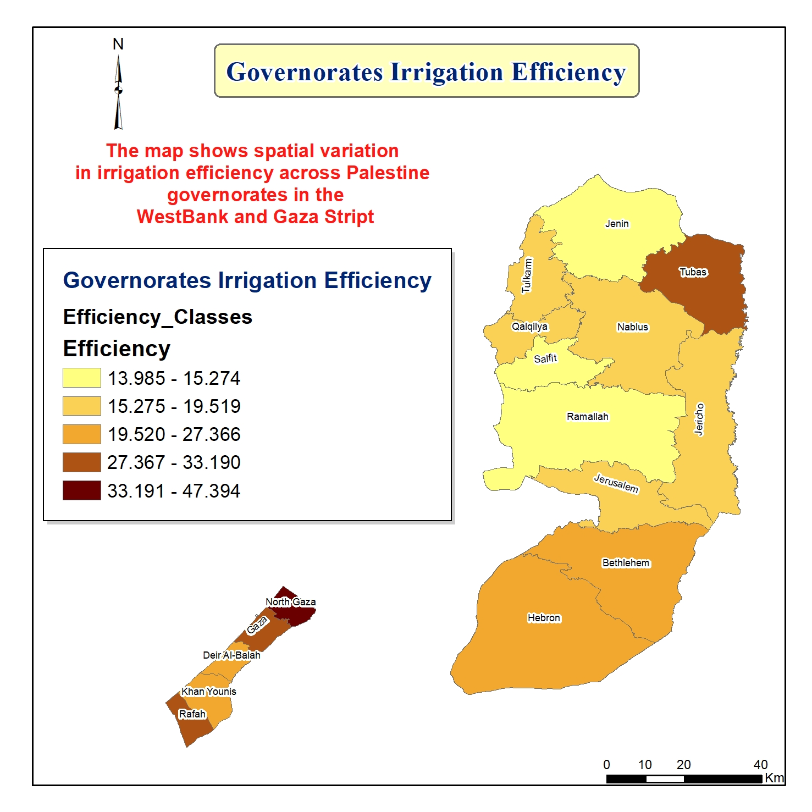
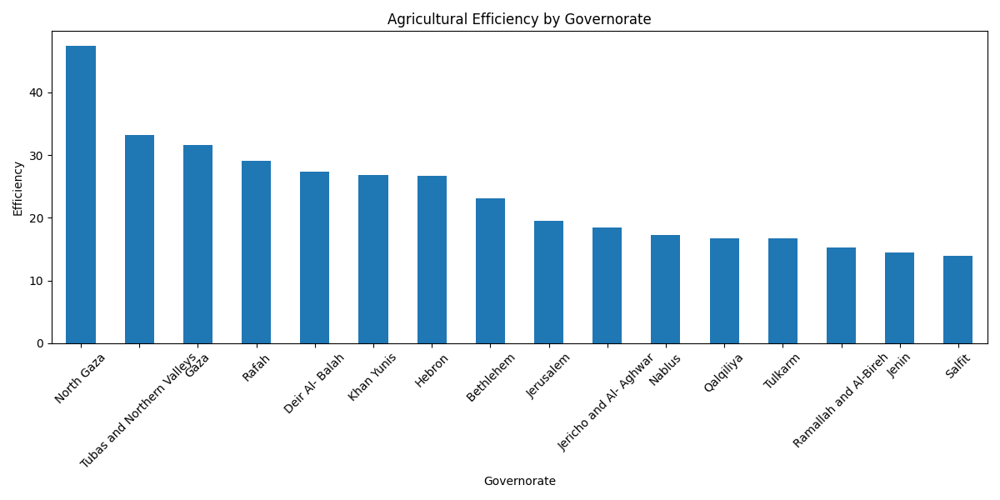
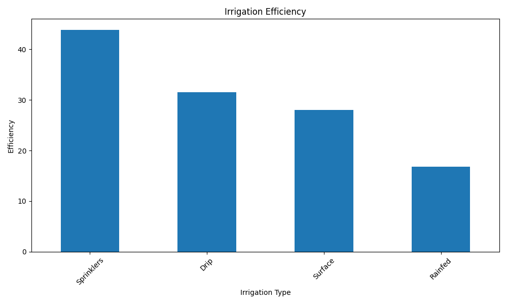
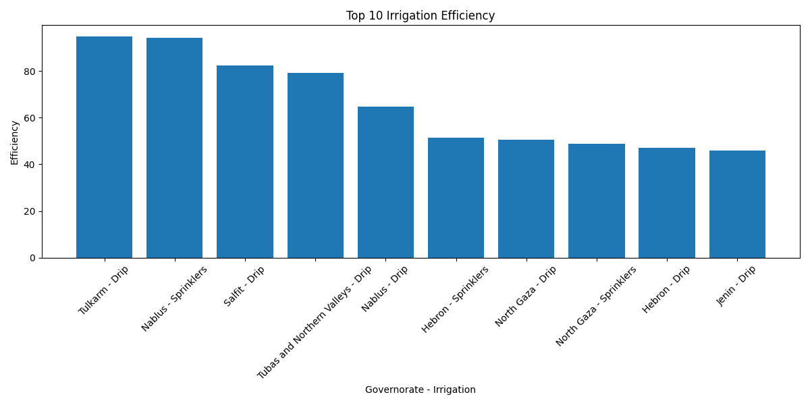

# Mustafa | Agricultural Engineer & AI Data Analyst

I am an Agricultural Engineer and spatial data scientist specializing in the intersection of agronomy, AI programming, and geospatial technologies. Holding an AI Programming with Python and TensorFlow Nanodegree alongside extensive GIS and remote sensing experience, I build intelligent data pipelines to optimize agricultural production, resource allocation, and spatial planning. 

Notably, I authored and published **"The Palestinian Atlas" (2020)**, leveraging comprehensive Geographic Information Systems (GIS) to map regional dynamics.

---

## 🛠️ Technical Core & Toolset

* **Agronomy & Engineering:** Agricultural Production, Food Processing, Irrigation Efficiency Modeling.
* **Geospatial & Remote Sensing:** QGIS, Esri ArcGIS, Spatial Analysis, Vector Data Management, Satellite Imagery Processing.
* **AI & Data Science:** Python, TensorFlow, Pandas, NumPy, Predictive Modeling, Automated Reporting Solutions (`python-docx`).

---

## 🚀 Featured Project

### Spatial Optimization of Palestinian Agricultural Irrigation: A Python & QGIS Data Pipeline

### 📝 Project Overview
This project processes raw data from the 2021 Palestinian Agricultural Census to evaluate, contrast, and visualize crop production efficiency metrics across different governorates and watering frameworks. By designing a custom automated data engine in Python, raw census arrays were cleaned, aggregated, and mapped spatially to expose regional high-performance benchmarks .

### 🔍 Core Project Metrics & Insights
* **Regional Efficiency Benchmarks:** North Gaza registered the highest localized productivity efficiency index (47.39), proving that smaller land footprints can yield highly optimized agricultural returns under effective system management .
* **Infrastructure Evaluation:** Modern pressurized delivery methods—specifically sprinkler systems (43.83 efficiency) and drip irrigation (31.55 efficiency)—vastly outperform traditional surface irrigation and extensive rainfed farming layout variants .
* **Peak Synergy Pairs:** Merging modern tech with specific micro-climates unlocks maximal output, proven by Tulkarm (Drip) and Nablus (Sprinklers) reaching peak efficiency indices of 94.93 and 94.24 respectively  .

### ⚙️ Data Pipeline Architecture
1. **Data Ingestion & Integrity Control:** Formatted and cleaned raw data files, dynamically dropping incomplete records and standardizing system variables.
2. **Multi-Index Matrix Aggregation:** Applied Pandas grouping logic to isolate intersecting regional variables, calculating absolute land area-to-yield efficiency scales.
3. **Geospatial Layout Generation:** Migrated structured tables into QGIS, executing spatial joins against regional boundaries to compile classified choropleth analytical maps.
4. **Document Delivery Automation:** Developed a script using the `python-docx` API workspace to programmatically generate data summaries, formatted tables, and structured reporting documents.

---

## 📚 Major Publications & Achievements

* **The Palestinian Atlas (2020):** Principal author and GIS developer. Compiled, analyzed, and mapped multi-layered spatial data into a cohesive published reference document for regional geospatial tracking.
* **Strategic Project Management:** Experienced in coordinating and managing technical and agricultural projects, ensuring alignment with strategic goals, optimized resource allocation, and rigorous data-driven quality control.

---

---

## 📬 Professional Links & Contact

* **LinkedIn:** [Mustafa Dweikat](https://www.linkedin.com/in/mustafa-dweikat-gisandaidata)
* **Upwork Portfolio:** [Mustafa Dweikat on Upwork](https://www.upwork.com/freelancers/~012342f51aba93745b)
